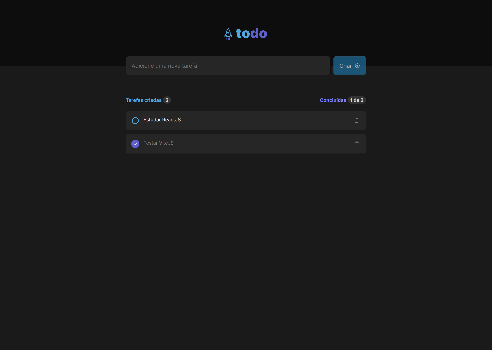
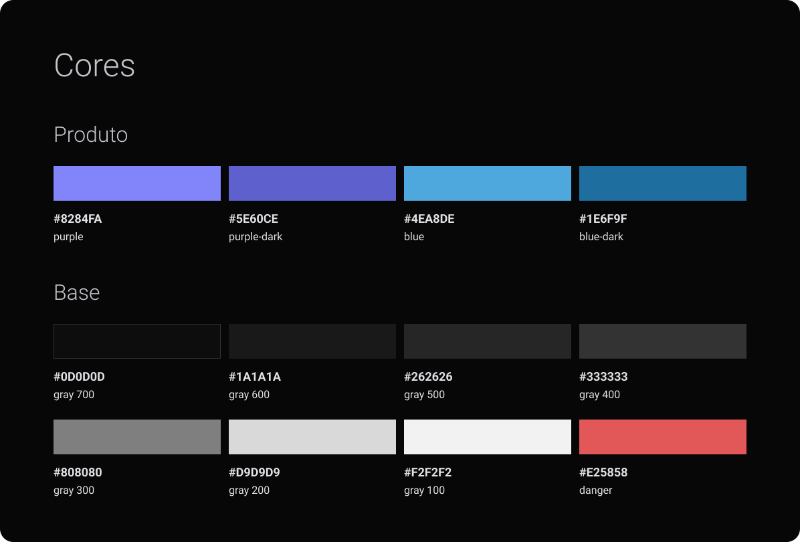
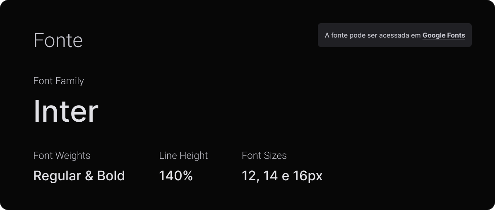
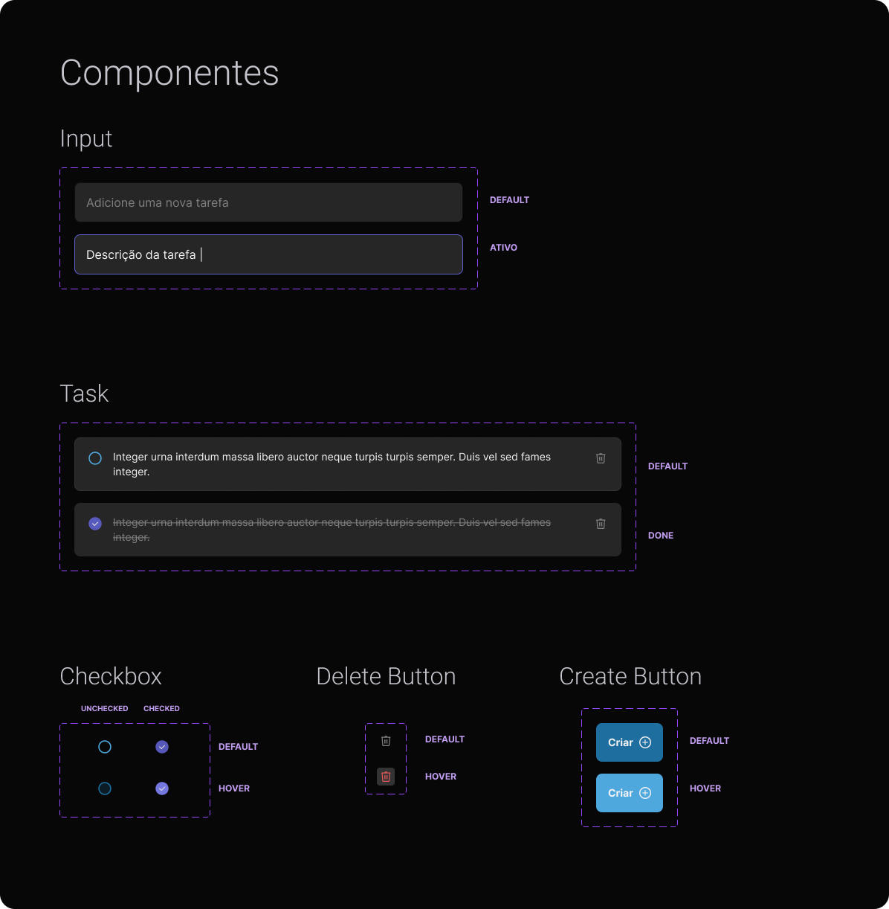

  
  
  <b>Aplicação Web, Realizada para testar funcionalidade do ViteJS</b>

 

# Índice

- [Sobre](#sobre)
- [StyleGuide](#styleguide)

## 📚 Sobre

O <strong>TodoList</strong> é uma aplicação desenvolvida em ReactJS com TypeScript utilizando ViteJS. O objetivo da aplicação é poder criar uma lista de tarefas.

Essa aplicação foi construída com o intuito de testar a ferramenta [ViteJS](https://vitejs.dev/)

# 🎨 StyleGuide

## Aplicação

 

## Cores

 

## Fontes

 

## Componentes

 

  <h4>
      Feito com 💜 por <a href="https://www.linkedin.com/in/filipebsmaia/" target="_blank">Filipe Maia</a>
  </h4>
  <h5>
    Design by
    <a href="https://www.linkedin.com/in/millenakmartins/" target="_blank">@millenakmartins</a>
    provided by
    <a href="https://rocketseat.com.br/" target="_blank">@rocketseat</a>
  </h4>

